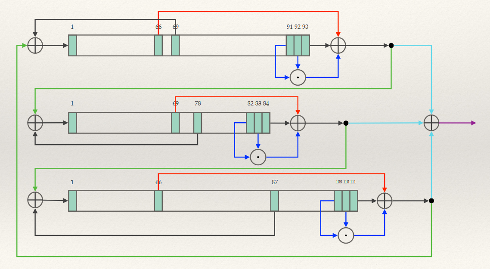

# Trivium stream cipher

The project is originally a mandatory assigment for the course "Applied Cryptography" INF 143A at the University of Bergen.
More about the assignment can be found below.

When running this code you will get the output of a test which was used to verify our solution to the assignment.
The solution is printed right bellow the test and is 1000 bits long.

You can also run the code with your own key and IV. After specifying IV and key, you can choose how many steps the stream cipher should take.
Each step corresponds to one bit, so if you want 1000 bits of key-stream you should run 1000 steps.

Requirements:

> The IV can't be longer than 93 bits.

> The key can't be longer than 84 bits.

For an explanation of how the Trivium stream cipher works, see the section below. 
The only thing that can't be modified is the "warm-up" steps. The cipher will always perform 1152 warm-up steps before producing output.

## The problem:
Write an implementation of the Trivium stream cipher, as
illustrated below. The symbol ⊕ denotes binary XOR, while ⊙ denotes binary
AND. The device is initialized as described in the lecture slides, that is:

 * _the 80-bit key is loaded into the first 80 bits of the 84-degree LFSR (the 
   “first” bits here refers to the left-most 80 bits);_
 * _the 80-bit initialization vector is loaded into the first 80 bits of the 93-
   degree LFSR;_
 * _the right-most 3 bits of the 111-degree LFSR are set to 1;_
 * _all remaining bits are set to 0._
 
Recall that the cipher performs 1152 “warm-up” steps before beginning to produce output.

Use your implementation with key *K* = (1, 0, 1, 0, . . . , 1, 0) (80 alternating
ones and zeros) and *IV* = (0, 1, . . . , 0, 1) (80 alternating zeros and ones) to
generate 1000 bits of key-stream.

## The stream cipher
To get more specific information about how this stream cipher works you can take visit to wikipedia through [this link](https://en.wikipedia.org/wiki/Trivium_(cipher))